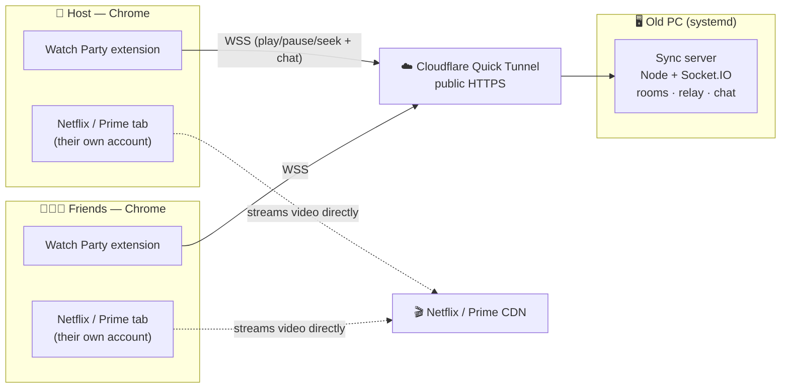
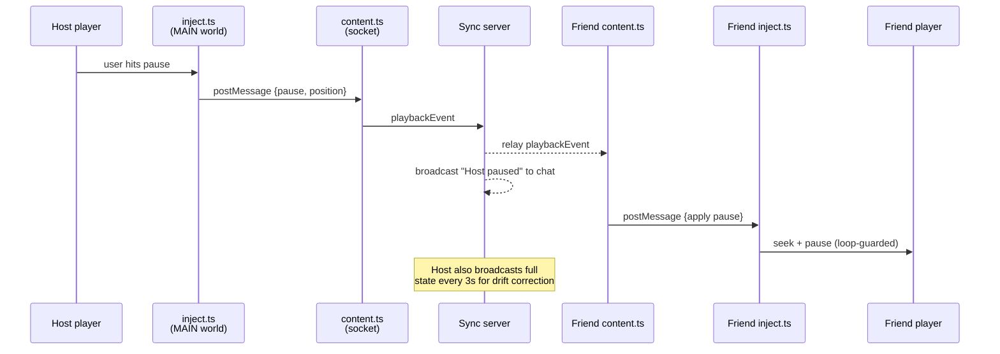
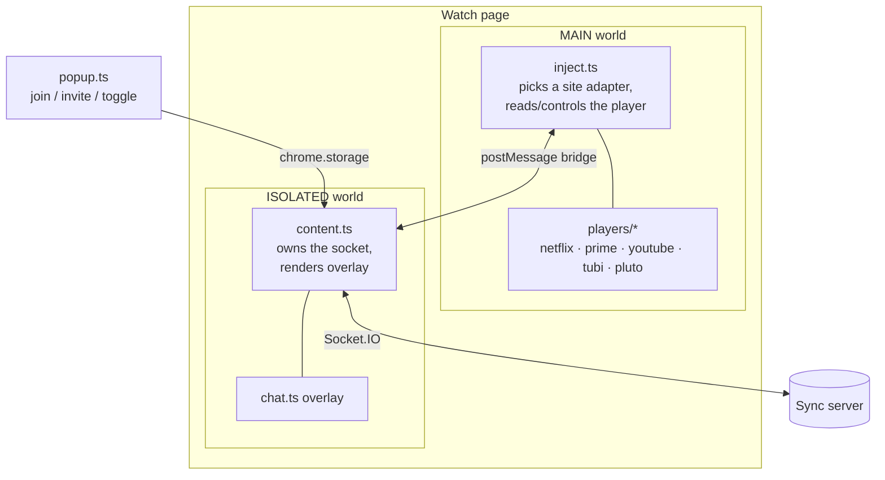

<div align="center">


# Watch Party

**Watch Netflix, Amazon Prime Video, YouTube, Tubi & Pluto TV in perfect sync with friends — with live chat, reactions, and a self-hosted server you fully control.**

<sub>Play · Pause · Seek stay synced for everyone · Live chat + emoji reactions · No video ever leaves your friends' own accounts</sub>

[](https://github.com/nkc-137/watchparty/actions/workflows/ci.yml)

</div>

---

## What is this?

Watch Party is a Teleparty-style tool for remote movie nights. Everyone streams
the same title from **their own** Netflix, Prime Video, YouTube, Tubi, or Pluto TV account, and a small
server keeps everyone's playback in step — when one person plays, pauses, or
seeks, everyone follows. A chat sidebar with emoji reactions sits over the video.

**No video is ever shared or re-streamed.** The server only relays *timing* and
*chat*, so quality stays perfect for each viewer, it dodges Widevine DRM
entirely, and each person watches on their own subscription.

It has two parts:

| Part | What it is |
| --- | --- |
| **`server/`** | A Node + TypeScript + Socket.IO sync server (rooms, event relay, chat). You run this. |
| **`extension/`** | A Manifest V3 Chrome extension (the player hook + chat overlay) your friends install. |

## Features

- 🎬 **Synced play / pause / seek** across everyone, with automatic drift correction
- 💬 **Live chat** with a member list and activity notices ("Alex paused", "Sam jumped to 25:00", joins & leaves)
- 😂 **Emoji reactions** that float over the video
- ⏳ **Buffer gate** — nobody starts until everyone has buffered, and if one person stalls mid-film the room parks and resumes together
- 🎯 **Wrong-title detection** — if someone opens a different episode, the room says so and ignores their play/pause/seek instead of dragging everyone to a meaningless timestamp
- 📶 **Latency badge** + one-click **⟳ resync** to snap back to the host
- 🫥 **Collapsible, translucent overlay** — or hide it entirely and keep syncing
- 🔗 **One-click invites** — a token bundles the server URL, room, and secret
- 🔒 **Self-hosted & private** — no accounts, no tracking; rooms gated by a shared secret
- 🧩 **Netflix, Prime Video, YouTube, Tubi & Pluto TV**, with a pluggable adapter system for adding more sites

---

## Quick start (try it locally in 5 minutes)

You need [Node.js](https://nodejs.org) 18+ and Chrome.

### 1. Run the sync server

```bash
cd server
npm install
npm run build
JOIN_SECRET=movie-night PORT=4000 npm start
```

Sanity check (in another terminal, server running): `npm run test:client` → prints `PASS`.

### 2. Build & load the extension

```bash
cd extension
npm install
npm run build            # outputs extension/dist/
```

Then in Chrome: open `chrome://extensions` → turn on **Developer mode** →
**Load unpacked** → select the `extension/dist` folder. Pin the **W** icon.

### 3. Watch together

1. Open a title — a Netflix `netflix.com/watch/<id>` page, a Prime Video title that's playing, or a YouTube `youtube.com/watch` page.
2. Click the **W** icon and fill in:
   - **Server URL** — `http://localhost:4000` for a local test
   - **Room code** — any shared word, e.g. `movie-night`
   - **Name**, and the **Secret** (your `JOIN_SECRET`)
3. Click **Join**. The first person in a room is the **host**; their play/pause/seek drives everyone.

> ℹ️ Browsers require a secure origin (`https://`/`wss://`) in production.
> `http://localhost` is fine for testing; for real parties put the server behind
> a tunnel (next section).

---

## Going live: host it for real

For actual movie nights the server should run 24/7 on a spare machine and be
reachable over the internet. The recommended free setup:

- Run the server + tunnel as a **Docker stack** on a Linux PC (manage it in
  Portainer, monitor it in Uptime Kuma). A `systemd` path is also documented.
- Expose it with a free **Cloudflare Quick Tunnel** (no domain, no router setup).

👉 **Full step-by-step in [DEPLOY.md](DEPLOY.md)** — the Docker `docker-compose.yml`
stack, the tunnel, a `party-url` helper, and the systemd alternative.

The Quick Tunnel gives a public HTTPS URL like
`https://something-random.trycloudflare.com`. It's free but **changes on every
restart/reboot**, so grab the current one before each session:

```bash
party-url        # helper set up in DEPLOY.md
```

Want a URL that never changes? Add a domain to Cloudflare and use a **named
tunnel** (see DEPLOY.md). A private, no-domain option is **Tailscale**.

---

## Inviting friends

Each friend does a one-time install, then joins in seconds.

**You (the host):**
1. In the popup, set the **Server URL** (`party-url`), **Room code**, and **Secret**.
2. Click **Copy invite** — this bundles URL + room + secret into one token.
3. Send them the token, and tell them which **title** to open.

**Your friend:**
1. **Install the extension once** — from the Chrome Web Store link (see
   [publishing](#publishing-to-the-chrome-web-store)), or load the `dist` folder
   unpacked.
2. Open the **same title** on the same service.
3. Click the **W** icon → **Paste invite** → type a **Name** → **Join**.

> 🔁 Re-share a fresh invite whenever the tunnel URL changes (i.e. after a PC or
> tunnel restart).

---

## Publishing to the Chrome Web Store

So friends install with one click instead of loading an unpacked folder. The
repo is pre-packaged for this:

```bash
cd extension
npm run package          # builds + creates watchparty-extension.zip
```

Then follow **[extension/PUBLISHING.md](extension/PUBLISHING.md)** to submit it
(publish **Unlisted** for a friends-only link). A ready privacy policy is in
[extension/PRIVACY.md](extension/PRIVACY.md).

---

## Architecture

Every participant runs the extension in their own browser and streams from their
own account. The server is a lightweight relay — it never sees video, only
timing and chat.



**How one action propagates** (host pauses → everyone pauses):



### Inside the extension

Chrome content scripts run in an **isolated world** and can't see a page's JS
globals (like Netflix's player API). So the extension is split across two worlds
that talk via `window.postMessage`:



- **`players/`** — one adapter per site behind a common interface
  (`players/types.ts`). Each adapter reports a `contentId()` (what is playing)
  and a `title()` (what to show), which is how the room tells "we're watching
  the same thing" from "you opened episode 2". An optional `isBuffering()`
  feeds the buffer gate; adapters that don't implement it simply never hold the
  room up. `netflix.ts` uses Netflix's private player API,
  `prime.ts`, `tubi.ts`, and `pluto.ts` drive the standard HTML5 `<video>` (via a
  shared `htmlVideo.ts` helper), and `youtube.ts` uses YouTube's `#movie_player`
  API. Add a service by writing a new
  adapter and registering it in `players/index.ts` — nothing else changes.
- **Content identity:** `contentId()` must come from the URL or the site's
  player API, never from a display title — titles are localized, so comparing
  them would falsely flag friends in other regions. Ids are only compared
  *within* one site (the same film on Netflix and Prime is a legitimate party),
  and an unknown id on either side means "can't tell", never "mismatch". A
  member whose id conflicts with the host's is dropped by the server and
  ignored by every client, and the overlay explains why. See
  `contentConflicts()` in `protocol.ts` — the one place the rule lives.
- **Buffer gate:** the server owns it. A play while anyone is still buffering
  becomes a `hold` instead of a relayed play, and everyone resumes together on
  `holdRelease`. Holds always end — on a timeout if someone never recovers
  (`holdTimeoutMs`), on a pause (which cancels), or when a blocker leaves — so
  one bad connection can never freeze the party.
- **Robustness tuning:** Netflix's `seek()` buffers gracefully; Prime's raw
  HTML5 seek is fragile, so its adapter rate-limits/coalesces seeks and avoids
  re-seeking on a plain pause (`minSeekIntervalMs`, `playPauseDriftSec`). Netflix
  keeps its tight, always-seek behavior (the defaults are no-ops).

### Repository layout

```
watchparty/
├── server/                 # Node + Socket.IO sync server
│   ├── src/
│   │   ├── app.ts          # server factory (rooms, relay, activity notices)
│   │   ├── index.ts        # entry point (reads env, listens)
│   │   ├── rooms.ts        # in-memory room registry + host election
│   │   └── protocol.ts     # shared wire types
│   ├── test/               # automated integration suite (npm test)
│   └── scripts/            # smoke test + virtual-participant harness
├── extension/              # Manifest V3 Chrome extension
│   ├── src/
│   │   ├── inject.ts       # MAIN-world player bridge (generic)
│   │   ├── content.ts      # ISOLATED-world socket + reconcile logic
│   │   ├── chat.ts         # collapsible overlay / dashboard
│   │   ├── popup.ts        # config, invites, show/hide toggle
│   │   └── players/        # per-site adapters
│   ├── icons/              # generated app icons
│   └── PUBLISHING.md · PRIVACY.md
├── DEPLOY.md               # host it on the old PC
└── README.md
```

---

## Testing

### Automated integration tests

The server has an integration suite that boots the **real** server on an
ephemeral port and drives it with **real** Socket.IO clients — covering rooms,
host election/handoff, play/pause/seek relay, chat, reactions, activity notices,
the `JOIN_SECRET` gate, drift/`requestSync`, late-joiner state, and
wrong-title detection, and the buffering holds:

```bash
cd server
npm install
npm test            # -> "26/26 passed" then "PASS"
```

No framework or extra services required — it's a self-contained runner
(`server/test/integration.test.ts`). Great for CI or a pre-deploy check.

There's also a quick two-client smoke script:

```bash
npm run test:client   # start the server first (npm start), then run this
```

### Manual end-to-end checklist

The extension's browser/DOM side is verified by driving a real browser:

- **Player control:** with the extension loaded on a title, the overlay reaches
  "connected"; pausing in one browser pauses another within ~1s.
- **Two-profile sync:** two Chrome profiles in the same room + same title stay in
  sync on play/pause/seek.
- **Remote:** from a device off your home network (phone on cellular) via the
  tunnel URL, a two-person party stays in sync end-to-end.

## Roadmap

- Deep-link invites (vs. paste tokens)
- Per-title auto room codes
- More streaming services (new adapters)

## License

Personal project — use it for your own movie nights. No warranty.
